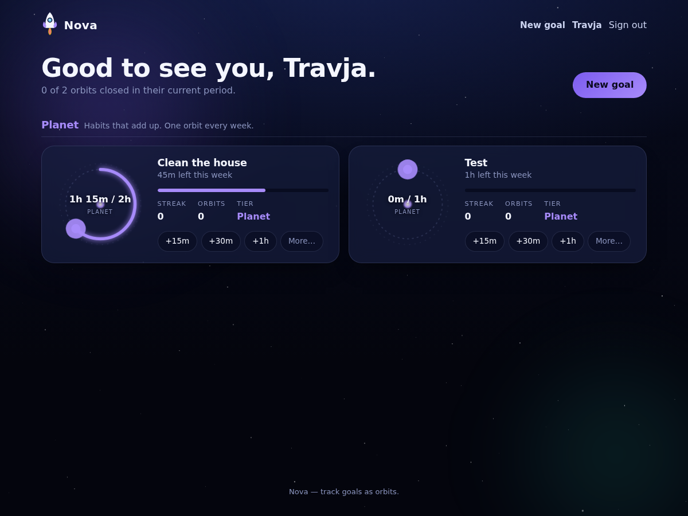

# Nova

Track your goals the way space keeps time — in orbits.

Nova is a space-themed, installable goal tracker. A goal is a body travelling
around its orbit; logging progress moves it along, and hitting the target for
the period closes one full revolution. Small goals are **Satellites** that come
around every day; the biggest are **Universes** that close once a year.



## The model

| Tier            | Orbits            | One revolution |
| --------------- | ----------------- | -------------- |
| **Satellite**   | a planet          | a day          |
| **Planet**      | a star            | a week         |
| **Star System** | the galactic core | a month        |
| **Galaxy**      | a cluster         | a quarter      |
| **Universe**    | everything        | a year         |

Every goal carries a **metric** (time, a count, or check-ins) and a **target**
per revolution. Cleaning the house for two hours a week is a Planet goal with a
120-minute target: log 45 minutes and the planet is 37% of the way around.

Period boundaries are drawn in the user's own time zone, so "this week" means
the same thing whether you log from home or from an airport.

## Stack

- **SvelteKit 2** with Svelte 5 runes, TypeScript throughout
- **SQLite** via **Drizzle ORM** — one file, trivially backed up
- **Sessions** with hashed tokens and Argon2id password hashing, no third-party auth
- **PWA** via `@vite-pwa/sveltekit` (Workbox), installable on iOS and Android
- **adapter-node** in a multi-stage **Docker** image

There is no separate backend service: SvelteKit's server routes are the API.

## Getting started

```bash
pnpm install
cp .env.example .env
pnpm db:migrate      # creates data/nova.db and applies migrations
pnpm dev
```

Open http://localhost:5173, create an account, and launch your first goal.

### Useful scripts

| Script             | What it does                               |
| ------------------ | ------------------------------------------ |
| `pnpm dev`         | Dev server with hot reload                 |
| `pnpm build`       | Production build into `build/`             |
| `pnpm start`       | Run the built server                       |
| `pnpm test`        | Unit tests (domain maths) with Vitest      |
| `pnpm e2e`         | End-to-end journeys with Playwright        |
| `pnpm check`       | Svelte and TypeScript diagnostics          |
| `pnpm lint`        | Prettier check plus ESLint                 |
| `pnpm format`      | Rewrite files with Prettier                |
| `pnpm db:generate` | Generate a migration from schema changes   |
| `pnpm db:migrate`  | Apply pending migrations                   |
| `pnpm db:studio`   | Browse the database with Drizzle Studio    |
| `pnpm icons`       | Regenerate the PWA icons in `static/icons` |

## Self-hosting

```bash
docker compose up -d --build
```

The database lives on the `nova-data` volume at `/data/nova.db`, and migrations
run automatically on every start.

Two environment variables matter in production:

- `ORIGIN` — must match the URL you browse to, or SvelteKit rejects form posts
  as cross-site.
- `DATABASE_URL` — defaults to `file:/data/nova.db` inside the container.

Put it behind a TLS-terminating reverse proxy: installing a PWA and storing a
session cookie both require HTTPS on anything other than `localhost`.

### Backups

Everything is in one SQLite file. With the container running:

```bash
docker compose exec nova sh -c 'sqlite3 /data/nova.db ".backup /data/backup.db"'
```

Or stop the container and copy `/data/nova.db` along with its `-wal` file.

## Project layout

```
src/lib/domain/     Pure logic: tiers, period maths, orbit progress, validation
src/lib/server/     Database schema, sessions, password hashing, services
src/lib/components/ Svelte components, including the animated space visuals
src/routes/         Pages and form actions
e2e/                Playwright journeys
scripts/            Migration runner and the PWA icon generator
```

`src/lib/domain` has no imports from `$lib/server` or SvelteKit, so the same
functions run on the server today and in the browser when offline logging
arrives.

## Contributing

Work is tracked as GitHub issues, grouped by milestone. `docs/ARCHITECTURE.md`
explains the decisions behind the shape of the code — read it before adding a
subsystem.

Before opening a pull request:

```bash
pnpm lint && pnpm check && pnpm test && pnpm e2e
```
