# The visual language

The space theme is not decoration bolted onto a progress bar — it _is_ the
progress bar. A goal's fraction becomes an arc, and the body sits at the point
the arc reached, so position and fill say the same thing twice.

Everything here is CSS and inline SVG. No animation library, no Lottie, no
raster assets, nothing that ships a runtime for decoration.

## The dial

`OrbitDial.svelte` draws one goal: a dotted track for the whole period, an arc
for what is logged, a star at the centre and the body parked where the arc
stops. The caption sits below the ring rather than inside it, so a goal measured
in `180 pages / 300 pages` still reads on a phone.

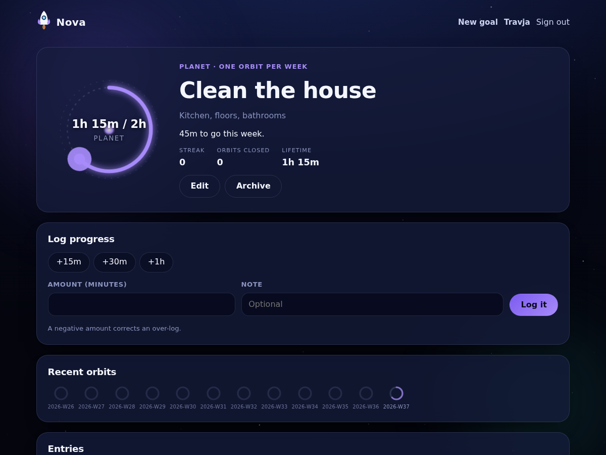

A closed orbit keeps travelling — the body carries on round the ring — because a
habit you have already hit today should look alive rather than finished.

## A body per tier, and a few per tier

Every tier used to be the same circle in a different colour, which made the
ladder the whole app is built on invisible until you read the label. Each tier
now has its own silhouette, and three bodies inside it, so a dashboard of six
satellites is not one drawing repeated six times.

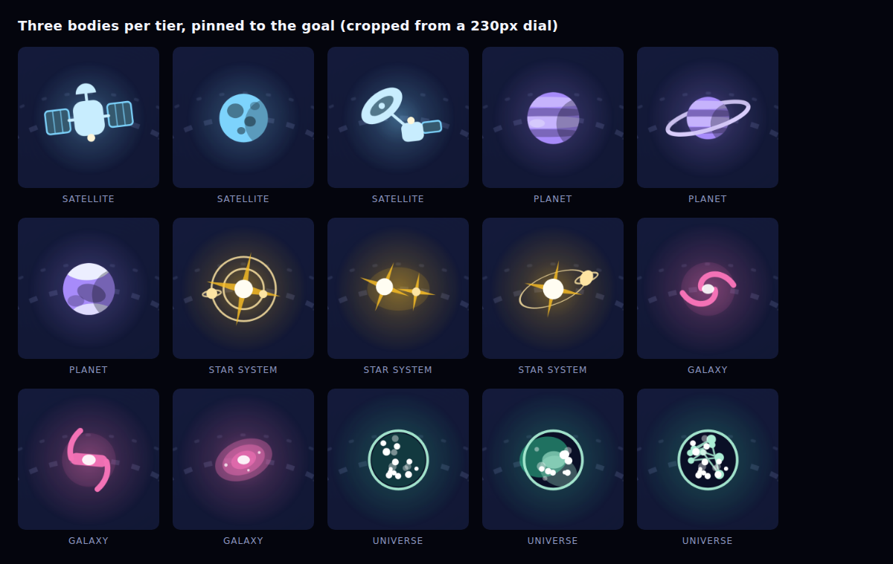

| Tier            | Bodies                                             |
| --------------- | -------------------------------------------------- |
| **Satellite**   | a comsat, a cratered moon, a dish probe            |
| **Planet**      | a banded giant, a ringed world, an ice world       |
| **Star System** | a star with worlds, a binary pair, a ringed system |
| **Galaxy**      | a spiral, a barred spiral, an elliptical           |
| **Universe**    | a field of light, a nebula, the cosmic web         |

Which body a goal flies is **pinned to its id** by `bodyVariant()` in
`src/lib/domain/bodies.ts`, which hashes the id and takes the remainder. Nothing
is stored on the goal row: there is no column to migrate, and no way for a body
to change under a goal that has been flying for a year. Ids are the only thing
about a goal that never changes — titles, colours and even tiers do.

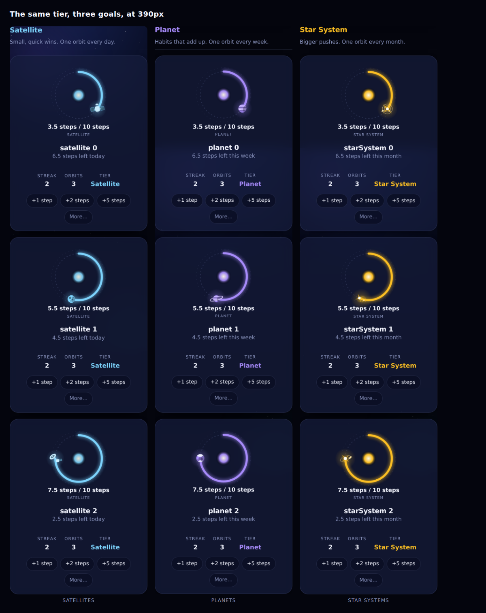

The one place this shows a white lie is the goal form's live preview, which
draws the tier's first body because the goal has no id yet.

### At 24px

The history strip draws the same body at a fraction of the size, where detail
stops being detail and becomes mush. Below roughly ten pixels across each body
drops to its tier's silhouette — disc and bar, banded disc, spike, swirl, dot
field — which is what stays readable when a ring is the size of a full stop.

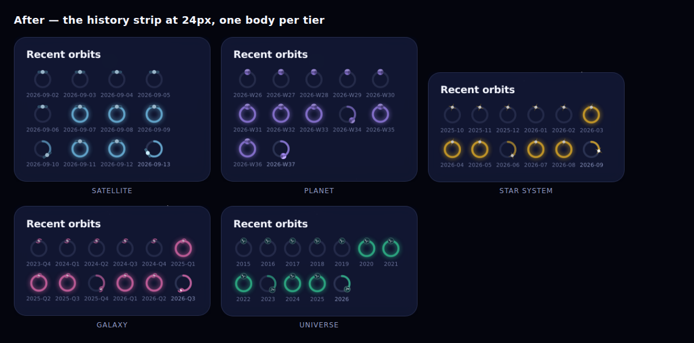

### Dormant orbits

A goal that was archived for a whole period never flew it, and that has to look
different from a period that was flown and missed. Dormant orbits are drawn
cold: grey, dimmed, with motion paused rather than removed.

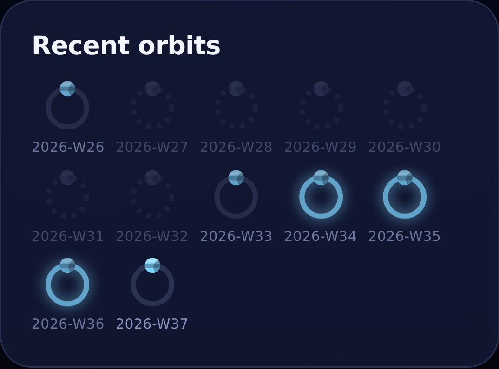

Above, W27–W32 were slept through and W26 and W33 were missed.

## Closing an orbit

The best moment in the app is the one that used to pass unnoticed. When a log
closes an orbit the arc sweeps up to full, an ignition fires where the body
reached, the streak lands rather than changing, and the pilot salutes.

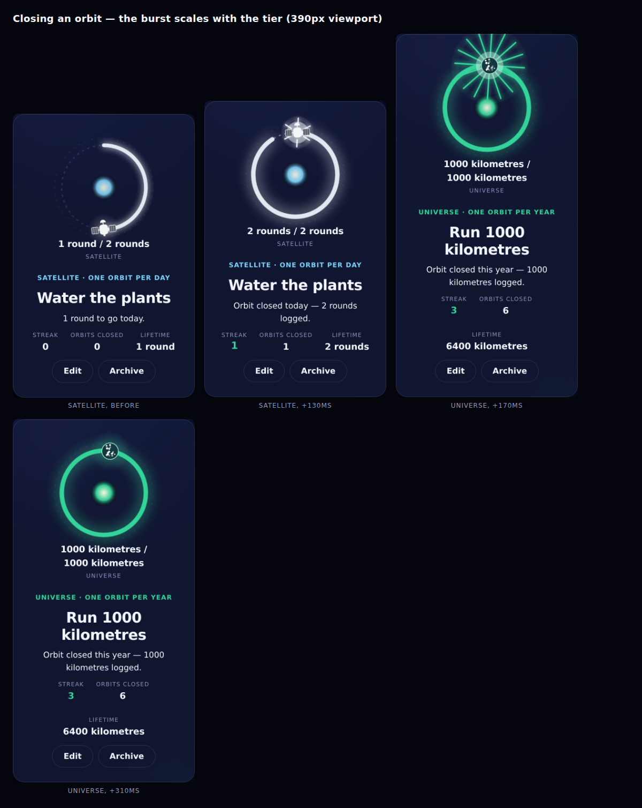

It scales with the tier, because a satellite closing daily and a universe
closing once a year are not the same news: six rays over 620ms for the one,
sixteen over 960ms for the other. Both are over inside a second, and neither
blocks anything.

It fires **once per closing** — never on a re-render, a second log into an orbit
that is already closed, a period that rolled over between looks, or a return
visit to a goal that closed yesterday. `src/lib/domain/celebration.ts` makes that
call on plain data, and `src/lib/celebration.svelte.ts` holds the tab's memory of
what each orbit looked like last time it was seen.

On `/today` a goal that closes leaves the at-risk list and takes its dial with
it, so the moment there is the row leaving, the live region naming the goal, and
the pilot's salute.

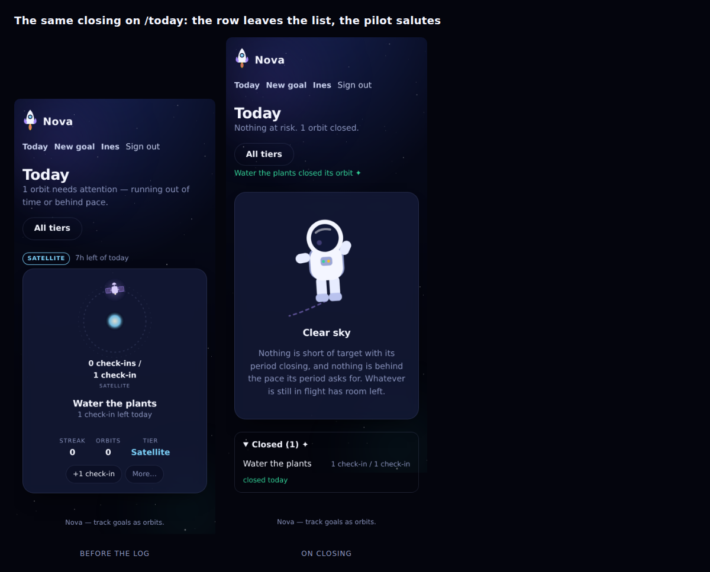

## The pilot

The astronaut used to drift on empty states and do nothing else. It now reads
the week off the same split `/today` is drawn from, and says what it sees.

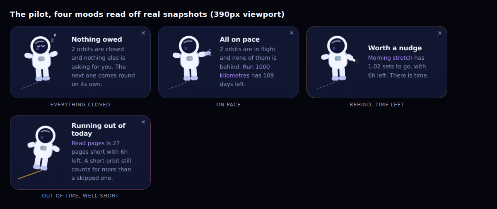

| Mood        | When                                                |
| ----------- | --------------------------------------------------- |
| **Resting** | everything that could close has closed              |
| **Working** | orbits in flight, none of them behind               |
| **Alert**   | something needs attention with time left to give it |
| **Adrift**  | a period nearly over and still well short of target |

`mascotFor()` in `src/lib/domain/mascot.ts` names the orbit that decided the
mood, so the pilot points at that one rather than gesturing at the screen. The
copy is warm on purpose — a missed orbit is information, not a telling-off — and
the pilot can be sent away with the ✕ if you find it distracting.

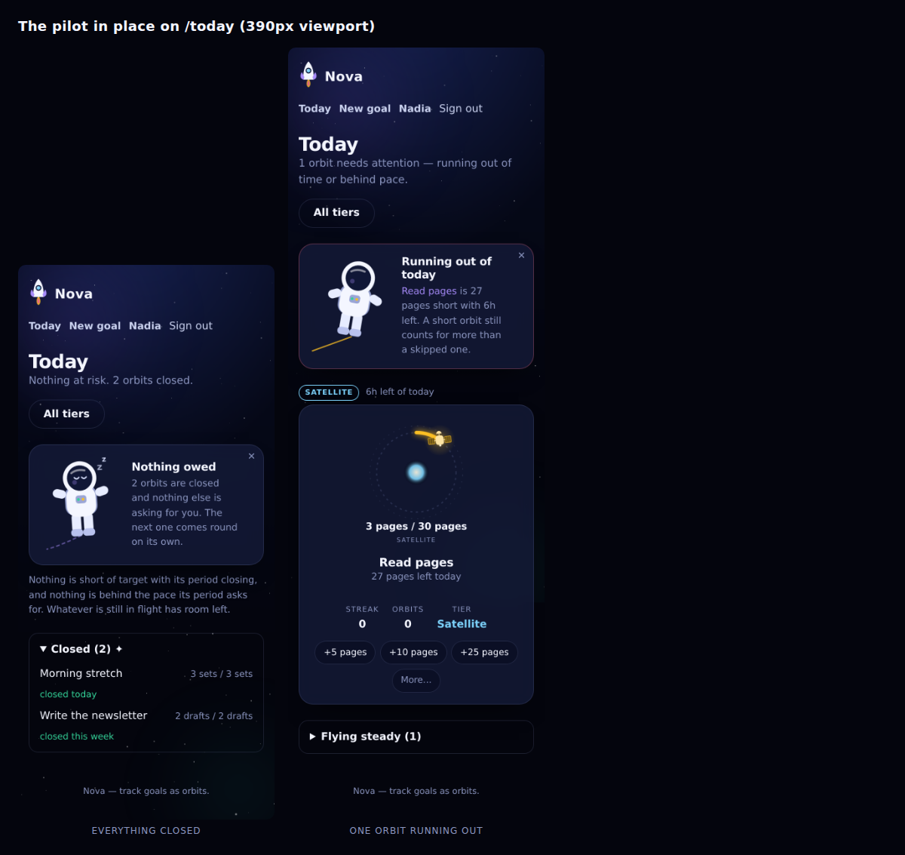

## The belt

An asteroid is the one thing in Nova with no period to complete, so it is the
one thing that is deliberately **not** a dial. There is no arc to fill and no
body travelling round to meet it. What there is instead is a distance — and a
distance needs two things to be a distance.

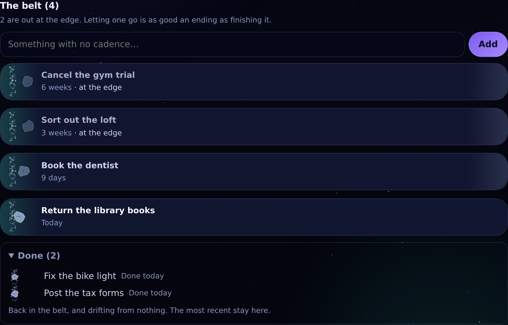

The swarm on the left is the belt itself, drawn as a slice of a very large ring
whose centre is far off the left of the box: a belt is an orbit that never
gathered itself up, and the curve is the only thing on screen still saying so.
Its specks are seeded from a **constant** rather than from the asteroid, so
every row draws the same belt — it _is_ the same belt. Two random draws are
averaged for each speck's distance across the band, which thickens it through
the middle and thins it at the edges; a flat scatter reads as noise rather than
as rubble.

The rock is the row's own, seeded from the asteroid's id the same way
`bodyVariant()` pins a goal's body — the shape, the craters, the direction it
tumbles and how long a turn takes all come out of that one hash, so no rock
tumbles in lockstep with its neighbour and the server and the browser carve the
same stone.

Where it sits is the whole message:

| Band         | Since the title was last written | Drawn                                 |
| ------------ | -------------------------------- | ------------------------------------- |
| **fresh**    | under a week                     | just clear of the swarm, full weight  |
| **drifting** | one to three weeks               | further out, dimmer                   |
| **faint**    | three weeks and beyond           | at the far edge, faintest             |
| **settled**  | finished                         | back inside the swarm, smaller, still |

`faint` and the release offer share their boundary on purpose: a rock reaching
the outer edge and Nova offering to let it go are the same fact, and giving them
a threshold each is two readings that can disagree. Drift is also **clamped** —
a rock nobody has touched for a year sits exactly where one of three weeks does,
because drift is a distance and not a debt that keeps growing.

A finished one-off is drawn back among the swarm rather than struck through.
Nothing here is a crossed-out line in a list; it is a rock that made it back,
and the drawing says which of the two a row is before the words do. It is drawn
smaller, because it is a line in a fold rather than a card, and **opaque** where
a drifting rock is not — at 90% the rubble shows straight through the stone, and
a rock you can see the belt through reads as part of the belt instead of as
something sitting in front of it.

The strip is its own element rather than part of the rock's box. The belt has to
run the whole height of whatever row it is in and the rock has to hold its
horizontal position exactly, and one element cannot do both: stretching a viewBox
to fill a variable height either squashes every circle in it or crops the side
the rock drifts towards. So the strip covers the row with
`preserveAspectRatio="xMidYMid slice"` — scaled uniformly, cropped top and
bottom, which is what a belt does anyway — and the rock sits in a fixed box laid
over it. Give that strip `height: 100%` and not `top: 0; bottom: 0`: an SVG
carrying a viewBox is a replaced element with an intrinsic aspect ratio, and
that ratio wins over a pair of offsets.

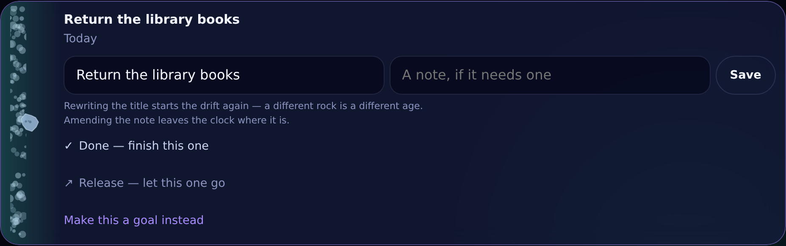

The belt never raises its voice. Both endings are outline pills rather than
`.button`s, the three-clear capture offer is a bordered note with no gradient
and no burst, and finishing one says "Done." in a muted line. Closing an orbit
is the biggest moment in the app and nothing on this band may compete with it.

### The row, and the swipe

A belt row is a rock, a title and how long it has been out there. It carries no
controls at all: its two endings are a swipe — right to finish, left to let go —
and everything else is a tap on the words, which are themselves the disclosure.

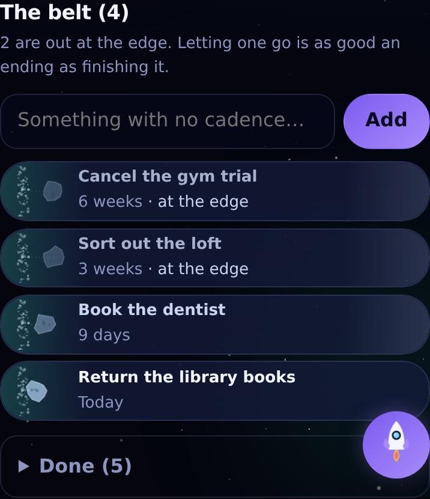

That is what bought the row its size. A control carries the touch floor, so any
line one sits on is 44px tall whatever else is on it, and a line holding nothing
but two buttons is the most expensive line a row can have. Without them a
compact row is two lines and 50px, against the 61px a goal row takes and the
128px this one took when the endings were labelled pills.

Under the card lie the two endings, each the colour of what it does — green for
finishing, stone for letting go. They are drawn only while a finger is on the
row, because a `.panel` is glass and a colour lying under one shows faintly
through it; and while a row is being dragged the card is opaque, so the colour
reads as a layer the card is moving off rather than as a stain spreading through
it. Both sides are muted until the drag commits and then lit, which is the whole
of the feedback.

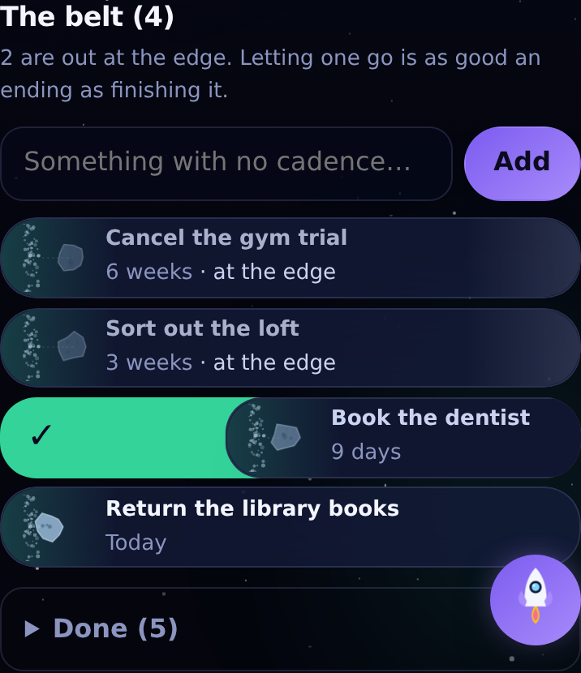

Standing still, each end of the card carries a wash of the colour a drag that
way would uncover — feathered far enough that there is no edge anywhere to read
as a status stripe. A row simply has a warm end and a cool one, and the first
swipe explains why. The cool end is drawn only where letting go is on offer.

**Letting go is not on offer until the rock has started to drift.** Something
written down an hour ago is a thing you meant to do, and offering to abandon it
before it has had a chance is the app second-guessing a decision nobody made.
`offersRelease()` opens that direction at the same boundary the drawing uses —
the moment a rock leaves `fresh` and visibly moves outward — so what the row
will accept escalates in step with the picture.

Stone rather than red, throughout. Letting go is a legitimate ending on equal
footing with finishing, and a colour that means danger everywhere else in an
interface would make it the one thing on the belt that looks like a mistake.

### A gesture is never the only way through a door

A swipe needs a pointer, a script and a hand, and the belt has to work without
any of the three. So every ending is also a plain button inside the row's
disclosure — where a keyboard, a screen reader and a browser running no script
find them — and what a committed swipe actually does is `requestSubmit()` the
same form that button posts. The row keeps two buttonless forms for exactly
that: one path to each ending, whichever way it was asked for.

The disclosure is the same content either way. `AsteroidDetails` holds renaming,
the note, both endings and the capture offer, drawn twice: as the body of the
row's disclosure at the default density, and as the body of `AsteroidSheet` in
compact — which is the move the goal row makes. Both copies are in the page,
which is what keeps the disclosure working when the sheet cannot open, so the
sheet's fields take an id prefix to stay unique.

The dialog belongs to `AsteroidBelt` rather than to a row, for the reason #51
found with goals: a `<dialog>` holds its place in the top layer only while its
own element stays put, and a row's element does not. Unlike `GoalRowSheet` it is
drawn only while it has something to show — nothing about the band moves, so
there is no mid-flight destruction to guard against, and the Today view is left
carrying one dialog rather than two.

Nothing in the row is a media query. Compact does what compact does everywhere
else — it changes the shape rather than the padding: the mark comes down to
44px and the title to `--text-secondary`. The drift always takes its short form
("6 weeks", not "Drifting 6 weeks"); the long one is a sentence, and the sheet's
header is where there is room for a sentence.

The explanation above the list is only drawn while the belt is empty. Four rocks
say what a belt is better than three lines of prose above them, and on a phone
those three lines cost more than the rock they describe.

## The rules

Four of these are load-bearing, and breaking any of them shows up immediately:

- **Everything yields to `prefers-reduced-motion`**, handled globally in
  `src/lib/styles/app.css`. A drag is the exception that proves it: the row
  following a finger is direct manipulation rather than decoration and stays
  whatever the setting says, while the snap back afterwards is a transition and
  is damped to nothing along with everything else. Position has to carry the meaning without motion,
  which is why a body is placed by the arc's angle and never by an animation,
  why the drifting pose is a static transform with the drift animated on top of
  it, and why the closing burst is simply not drawn.
- **Anything random uses a seeded generator.** The starfield and a universe's
  field of light both come from one, so the server and the browser draw the same
  sky and hydration stays quiet. A bare `Math.random()` in a component is a
  hydration mismatch waiting to happen.
- **Size in pixels, not user units, inside a stretched viewBox.** A
  `preserveAspectRatio="none"` SVG turns circles into ellipses; the starfield
  sizes its stars in pixels for exactly this reason. The dials are square, so
  bodies there are free to use user units.
- **Draw it, then look at it at the size it ships at.** Almost everything on
  this page was redrawn at least once after seeing it on a 390px screen: haloes
  that read as coins, flares that swallowed their own orbit rings, a dish that
  looked like a monocle, a binary that was two specks.

## Where it lives

```
src/lib/components/OrbitDial.svelte     The dial: track, arc, core, body, burst
src/lib/components/TierBody.svelte      Picks the body and sets its colours
src/lib/components/bodies/              One file per tier, holding its bodies
src/lib/components/OrbitHistory.svelte  The strip of recent orbits
src/lib/components/Mascot.svelte        The pilot, and the copy beside it
src/lib/components/Astronaut.svelte     The sprite itself, one pose per mood
src/lib/components/Starfield.svelte     The backdrop, three parallax layers
src/lib/components/Asteroid.svelte      One rock, and the belt it drifted out of
src/lib/components/AsteroidRow.svelte   A one-off and its two endings
src/lib/components/AsteroidBelt.svelte  The band, the capture offer, the Done fold
src/lib/components/AsteroidDetails.svelte  Rename, note, capture and let go
src/lib/components/AsteroidSheet.svelte The sheet a compact belt row opens
src/lib/domain/bodies.ts                Which body a goal flies
src/lib/domain/celebration.ts           Whether a closing just happened
src/lib/domain/mascot.ts                What the week adds up to
src/lib/domain/asteroids.ts             Drift, its bands, and the capture offer
```

The three domain modules are pure functions over plain data, tested like the
rest of `src/lib/domain`. Nothing about how something looks is decided inside a
component if it can be decided on the data instead.
