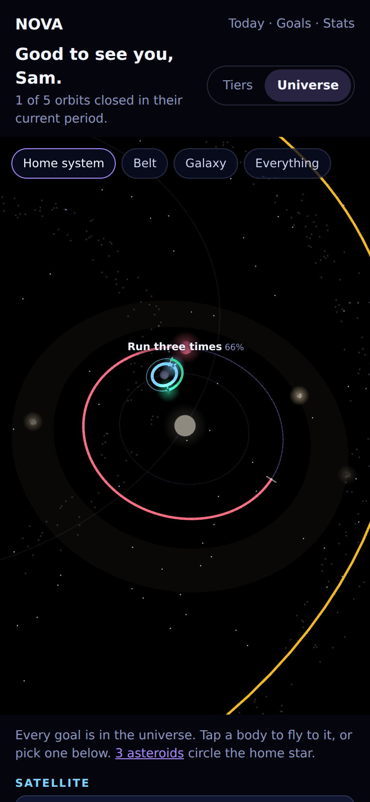
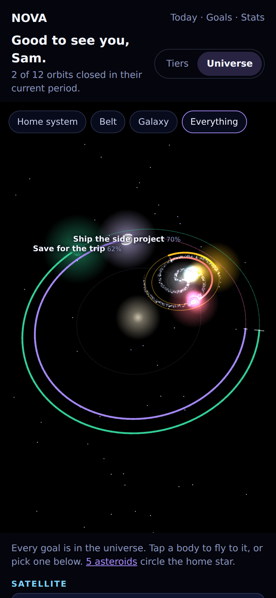
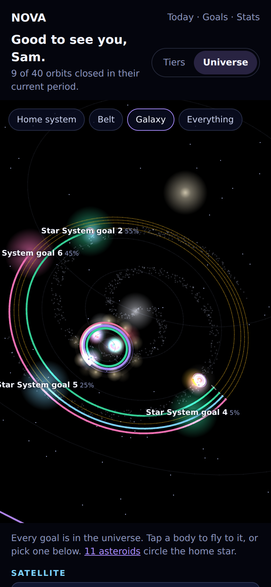
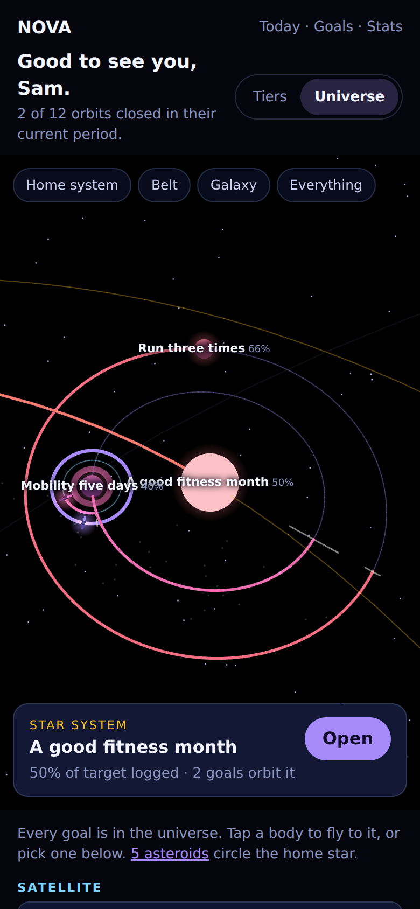
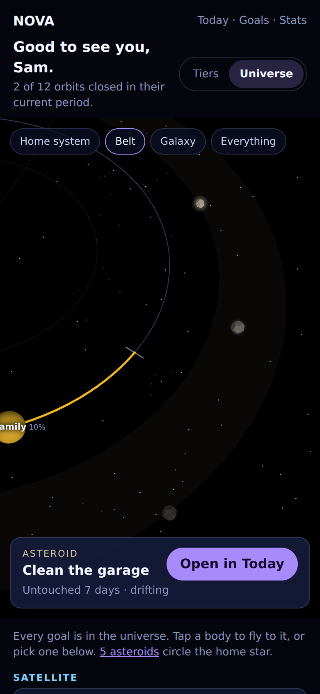
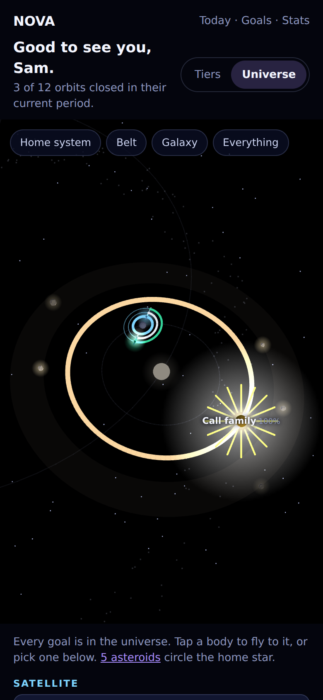

The dashboard is a grid of separate dials. The metaphor promises something better:
one universe, with your goals as bodies at their true relative scales — satellites
whipping round, a universe barely moving — that you can turn, zoom into and fly
across.

A single 3D scene where:

- Every goal is a body orbiting something real: its parent goal, or the kind of
  thing its tier orbits.
- A coloured trail along each orbit shows how far round this revolution has come.
- Dragging turns the view, pinching zooms, tapping a body flies to it and pulls up
  the goal.
- It works on a 390px-wide phone, which is the hard part.

It is an alternate view of `/`, not a replacement, behind a remembered toggle.

The prototype this spec was written against is
[`docs/prototypes/11-system-view/index.html`](../prototypes/11-system-view/index.html)
— one file, three.js from the CDN, open it in a browser and drag it around. The
screenshots are it, rendered at 390px by the script beside it.

| 5 goals, home system                                          | 12 goals, everything                                                              | 40 goals, galaxy                                                                |
| ------------------------------------------------------------- | --------------------------------------------------------------------------------- | ------------------------------------------------------------------------------- |
|       |  |  |
| **Tap a star system**                                         | **The belt, a rock tapped**                                                       | **A closing**                                                                   |
|  |                        |                |

## What the universe is

A tree of hosts and orbits, drawn in 3D.

Every goal orbits a **host**. When the goal has a parent (#12), the host is the
parent: a Planet whose weeks feed a Star System goes round that star. When it has
none, the host is an **anchor** — a piece of scenery of the kind its tier's
definition already says it orbits (`TIER_DEFINITIONS[tier].orbits`: "a planet",
"a star", "the galactic core", "a cluster"). Anchors are grey, dim and cannot be
tapped. They exist so nothing floats.

Every host has its own **orbital plane**, tilted by a seeded angle, so the scene
is a universe rather than one flat disc. Each child sits on its own **orbit** in
that plane, at the angle its progress puts it, with a **trail** in the goal's
colour from a start mark round to the body. Position and fill say the same thing
twice, exactly as they do on the dial.

The orbits nest across five orders of magnitude — a satellite a fraction of a unit
from its dwarf planet, a universe hundreds of units from the centre — and the
camera moves between them. At every scale the thing in front of you is a readable
system of rings; everything further in is a point of light you can fly into.

## Decisions

Each question has one answer. The build session should not re-decide any of them.

### 1. The renderer: three.js, lazy-loaded, confined to one directory

**WebGL through three.js, loaded only when the universe view is showing, and only
from `src/lib/universe/`.** This changes a project rule, on purpose, and the
build changes the rule in the same pull request.

`CLAUDE.md` says "CSS and inline SVG only. No animation library." That rule was
written for dials, and the universe is not a dial: it has to draw five orders of
magnitude of scale, a camera that moves in three dimensions, depth, and a few
thousand particles for galaxy discs, and it has to hit-test a finger against all
of it. The rule becomes:

> CSS and inline SVG only — except the universe view (#11), which is WebGL through
> three.js, dynamically imported, and lives entirely in `src/lib/universe/`.
> Nothing else imports three.

What the rule protected survives. `src/lib/universe/` holds **no progress maths**:
which body orbits what, at which radius and angle, and how long its trail is are
decided by the pure `$domain/universe` (the sketch below), the same way
`src/lib/offline/` holds the browser half of the queue and none of its maths. The
one architectural rule is untouched — `$domain` still imports nothing from
SvelteKit, the server, or three.

- **Pin an exact version** of `three` and `@types/three` in `package.json`, no
  caret: three ships breaking changes in minor releases. The prototype pins
  0.170.0; the build pins whatever is current and passes the prototype's
  behaviour.
- **Import only what is used** — `three` core, `OrbitControls`, `Line2` /
  `LineGeometry` / `LineMaterial`, `CSS2DRenderer` — so the chunk tree-shakes.
  Budget: the universe chunk is **at most 180 kB gzipped**, checked from the build
  output in the pull request. The tiers view downloads none of it.
- **The chunk is precached by the service worker** like any other route chunk, so
  the universe works offline once it has been seen online.

Rejected:

- **Inline SVG.** Built first, in [`flat.html`](../prototypes/11-system-view/flat.html):
  one flat sky of concentric lanes, one lane per goal. It is readable at a dozen
  goals and caps at about that, because a circle 360px across holds about twelve
  lanes; forty goals drew fourteen bodies
  ([screenshot](../screenshots/11-system-view/flat-40.png)). It cannot zoom through
  scales, has no depth, and every tier orbits the same point, which is the thing
  this issue's owner asked to get away from.
- **Canvas 2D with a hand-written projection.** No dependency, and a 3D renderer,
  camera controls with pinch and damping, depth sorting and picking that Nova
  would have to own and debug forever. three.js is that code, already tested on
  every phone.
- **Babylon.js, PlayCanvas.** Engines, several times three's size, built for games.
- **regl or raw WebGL.** Everything three gives for free — lines with a pixel
  width, sprites that hold a pixel size, orbit controls — rebuilt by hand.

### 2. Hosts: what each goal orbits

| Goal tier   | Orbits, when it has a parent goal | Orbits, when it does not      | Drawn as                                             |
| ----------- | --------------------------------- | ----------------------------- | ---------------------------------------------------- |
| Satellite   | its parent                        | a **dwarf planet** anchor     | a small craft, its glow held at 12px                 |
| Planet      | its parent                        | a **star** anchor             | a sphere, ringed for one variant in three            |
| Star System | its parent                        | a **galactic core** anchor    | a star in the goal's colour, its own system round it |
| Galaxy      | its parent                        | the **cluster** at the centre | a two-armed particle disc wrapping its children      |
| Universe    | —                                 | the **cluster** at the centre | a wireframe shell, the largest body there is         |

And the anchors themselves: a dwarf planet orbits a star anchor, a star anchor a
galactic-core anchor, and a core the cluster. So a single loose satellite brings
its dwarf, the dwarf's star, the star's galaxy and the cluster with it — the
"home" chain — and the first of each anchor kind is what the scale strip
(decision 7) calls **Home system** and **Galaxy**.

- **Anchors are scenery.** Grey or desaturated, dimmer than any goal, no trail,
  a whisper of an orbit line, and never candidates for a tap. A goal must never be
  mistakable for one: an anchor star is `#8f8a80` and 0.6 of a goal star's
  radius.
- **Anchors appear only when needed** and never for their own sake. An account
  with only Star System goals has a galactic core and a cluster and nothing else.
- **An anchor takes six loose goals** (`ANCHOR_CAPACITY = 6`). The seventh loose
  satellite gets a second dwarf planet, on the same star. The forty-goal account
  has two dwarfs, two stars and two cores (`universe-40.png`). Six is where a
  host's rings stop reading as separate at phone width; a real parent goal is
  never split, however many children it has.
- **Anchor positions are seeded** from the anchor's id, which is its kind and
  index (`dwarf-0`), so the home system is in the same place every visit.

Rejected:

- **Every goal round one central star**, which is what the flat sky did. A galaxy
  orbiting the same point a satellite orbits is the metaphor contradicting itself.
- **Loose goals in empty space.** Nothing to orbit means no orbit to trail and no
  angle to read.
- **Tappable anchors** that open, say, "all your loose satellites". A second kind
  of thing to tap, with nothing to log against.

### 3. Nesting: children orbit their parent goal, at every depth

**A goal whose parent is in the universe orbits that parent, whatever depth it is
at.** A Satellite feeding a Planet feeding a Star System is a moon of a planet of a
star (`universe-12-focus.png`: "Mobility five days" is a planet of "A good fitness
month", with Stretch and Meditate round it).

This is the move `OrbitDial` already makes for one level (#12), and 3D is what
lets it go all the way down: each host is framed at its own scale, so depth costs
nothing.

- **A child that skips a rung** — a Satellite feeding a Star System directly —
  orbits the star directly, drawn as a satellite. The body says its tier; the host
  says what it feeds.
- **A goal whose parent is archived** is not in `listGoalSnapshots()`'s result, so
  it orbits an anchor like any loose goal.

Rejected: drawing children in their own tier's place with a line to the parent
(tethers across five orders of magnitude are invisible at one end and huge at the
other), and drawing them twice.

### 4. Overlap at identical progress: one orbit per child, as wide as what it carries

**Every child of a host gets its own orbit radius. The angle is always exactly its
progress.** Two goals at 50% sit at the same angle on different orbits
(`universe-12.png`: Journal and Duolingo round the home dwarf).

Radii come from the flat sky's lane rule, applied recursively: a child's orbit is
as far out as it needs to clear the child inside it plus the child's own
**extent** — its body, or, when it has children, its outermost orbit. So a Star
System with three planets takes a wider lane round its galactic core than one with
none, and no two bodies can touch at any angle.

Children are ordered anchors first, then by tier, then by `sortOrder`, innermost
first — the order someone set with #4 is the order the rings go outward.

Rejected, as before: nudging the angle (it claims progress that was not made), a
force layout (logging one goal would move another), and sharing an orbit while
angles are apart (a body would jump orbits because a different goal moved).

### 5. Forty goals: it works, because you zoom

**Forty goals all appear. Nothing is capped, summarised or left out.** A universe
is big, and the camera goes to where the goals are.

What is readable where, at 390px (all from the prototype's forty-goal account):

- **Home system** (`universe-40.png`): the home star, its six loose planets, a
  dwarf with its satellites, and the belt. Every trail readable, labels on the
  planets.
- **Galaxy** (`universe-40-galaxy.png`): the home core's star systems, each a lit
  star with its own small system, trails readable, labels on each.
- **Everything** (`universe-40-everything.png`): galaxies and universes round the
  cluster. This view is busy at forty and that is acceptable: it is for
  orientation — where is everything, and which way do I fly — not for reading.
  Every trail is still there, and labels declutter (decision 9).

The budget that bounds this is draw cost, not space. Forty goals is about sixty
meshes, a hundred lines and a few thousand points — nothing for a phone GPU.
Designed and checked to forty; it should hold to a couple of hundred, after which
"Everything" becomes a smear, which is honest.

Rejected: capping at a dozen (the flat sky's answer, which this design exists to
get past), and aggregating a tier into one body (an average is a number none of
the goals has).

### 6. Trails and orbits: sized in pixels, not units

- **Orbit:** the full revolution, 1px, in the tier's accent at 35% opacity.
- **Trail:** from the start mark round to the body, in the goal's colour, 2.6px;
  3.2px once closed, when it is the whole ring.
- **Start mark:** a short white tick across the orbit at angle zero, so "how far
  round" has somewhere to count from when you are looking at a tilted ring.
- **Glow:** every goal body carries an additive glow held at a fixed pixel size —
  12px for a satellite up to 46px for a universe — so a body a galaxy away is still
  a point of the right colour and the scene never loses a goal to distance.

All of these are pixel sizes (`LineMaterial` widths are pixels; sprites use
`sizeAttenuation: false`, scaled from the view's height on resize). This is the
`CLAUDE.md` rule — size in pixels, not user units, for anything that must keep its
shape — carried into 3D: a 2.6-unit trail would be invisible at "Everything" and a
girder at "Home system".

### 7. Navigation: orbit controls, named places, fly-to

- **Gestures** are three's `OrbitControls`: one finger turns, pinch zooms toward
  the fingers, two fingers pan; on desktop, wheel zooms toward the cursor and
  right-drag pans. Damped. Distance clamped to 0.8–60 000 units. The canvas has
  `touch-action: none`; the page scrolls by the strip above and the list below it.
- **The scale strip** over the top of the view: **Home system · Belt · Galaxy ·
  Everything**, real buttons, the current one `aria-current="true"`. Each flies the
  camera to frame that place. They are the way back from anywhere, and the
  single-pointer alternative WCAG 2.5.7 asks for, since every gesture above is a
  drag. A place with nothing in it is not in the strip.
- **Where it opens:** Home system when there is one — that is where the daily and
  weekly goals are, which are the ones most often acted on — otherwise Everything.
  Always there, not wherever the camera was last: a remembered camera is stale the
  moment goals are added.
- **Fly-to:** 900ms, ease-in-out, target and eye together. It frames the host's
  whole extent across the narrower side of the view — on a phone, the width — with
  the camera above the host's plane at a slant, so rings read as rings. A goal
  with nothing orbiting it is framed with its own orbit's neighbourhood in view,
  so its trail comes with it.
- **The camera never moves on its own.** No idle auto-rotate, no intro fly-through,
  no following a lapping body.

Rejected: free first-person flight (WASD, a virtual joystick) — disorienting on a
phone and a second control scheme to learn — and a remembered camera.

### 8. Tapping: fly to it and show a card

**A tap — a pointer that went down and up within 6px — picks the nearest goal
body or asteroid within 24px on screen, flies to it (decision 7), and shows a card
over the bottom of the view.** Anchors are never candidates. Nearest on screen
rather than a ray cast, because most bodies are a few pixels across and a ray has
to hit them exactly.

- **A goal's card:** tier, title, `orbitStanding()`-style standing, and "N goals
  orbit it" for a parent, with **Open**, which opens `GoalRowSheet` for that goal
  — the same sheet the list rows open, where logging happens.
- **An asteroid's card:** "Asteroid", its title, "Untouched N days · drifting",
  and **Open in Today**, which goes to `/today#belt`. The camera does not fly to a
  rock; it is shown where it is (decision 12).
- **A tap on nothing** closes the card.

Nothing is logged from the universe itself. A second log surface on a 5px target
is a mis-tap generator.

### 9. Labels: the title beside the body, when there is room

Each goal carries an HTML label — its title and percentage — positioned by
`CSS2DRenderer`. It is shown only when the body is at least 70px on screen from
its host, which is to say when its orbit is wide enough at this zoom to be read.
Zoom in and labels appear; zoom out and they fold back into points.

The build adds what the prototype does not do: **declutter**. When two visible
labels overlap, the one whose body is larger on screen wins; ties go to the nearer
body. At most twelve labels at once. `universe-40-everything.png` shows why
("Planet goal 2" and "Planet goal 5" on top of each other in `universe-40.png` too).

Labels are `aria-hidden` like the rest of the canvas. Titles are page content,
shown behind the session like anywhere else in the app; the rule about
notifications never carrying the user's words is untouched.

### 10. Motion: still on arrival, moving on change, closed orbits keep circling

The dial's rules, kept:

- **Open goals are parked** at their progress angle. A log moves the body and
  grows the trail over `SWEEP_MS`, together.
- **A closed orbit keeps travelling**, round its full lit ring. One lap takes 16s
  for a satellite, 40s for a planet, 90s for a star system, four minutes for a
  galaxy and fifteen for a universe (`UNIVERSE_LAP_SECONDS`). A lapping host
  carries its children with it; their angles are relative to it, so they stay
  true.
- **Anchors, galaxy discs and the belt are still.** Nothing moves that is not a
  goal saying something.

**The frame loop** runs continuously only while motion is allowed and a closed
body is on screen; otherwise it renders on demand — when the controls change, a
flight is in progress, or the data does. It stops when the tab is hidden or the
canvas is scrolled out of view (`IntersectionObserver`). A phone left on the
dashboard should not run a GPU at 60fps for a picture that is not moving.

Rejected: continuous orbiting of every goal (position would stop meaning
progress), an entry animation (every visit, loudest thing on screen, competes with
the closing).

### 11. Reduced motion: the still universe is the universe

The global CSS rule in `app.css` does not reach a WebGL canvas, so
`src/lib/universe/` reads the effective motion itself: `data-motion` on `<html>`
(`none` or `reduced` stills it, `full` animates it) and otherwise
`prefers-reduced-motion`, re-read when either changes. Put that in one small
browser helper (`$lib/motion.ts`, `motionAllowed()`) rather than inside the scene,
so the next canvas does not re-derive it.

When motion is not allowed: closed bodies stay at the start mark on their full
ring, which is what 100% looks like; fly-to is an instant cut; damping is off; the
closing is the lit ring without rays or flash. Gestures still work — moving the
camera yourself is not motion the app imposes.

Nothing in the universe carries information in motion, so the still frame is the
whole universe. `universe-12-still.png` is that frame; compare it with
`universe-12.png`.

### 12. The closing: in the sheet, and the universe lights the ring

**Logging happens in `GoalRowSheet`, so a closing logged from the universe is
celebrated inside the sheet by its own `OrbitDial`, exactly as #51 settled.** The
sheet stays open. That burst is the biggest moment in the app and stays so.

The universe reads `celebrationFor(goalId)` like any dial and, while it is set and
the universe is not covered by the sheet, draws its own version at the body
(`universe-12-closing.png`):

- the trail completes and brightens into the whole ring, twice its width, for the
  length of `celebrationShape(tier).ms`;
- `celebrationShape(tier).rays` rays and a white flash at the body, billboarded to
  face the camera, reaching six body radii;
- the camera does not move to it. Yanking the view to a closing the user did not
  ask to look at is the universe taking control; the ring lighting is visible from
  wherever they are.

A polite live region under the view reads `celebration()`: "{title} closed its
orbit", the mascot's sentence on `/today`. That is what reduced motion and screen
readers get in place of the rays.

Rejected: closing the sheet so the universe gets the moment (#51 forbids it), a
second burst when the sheet closes (`noteOrbits` calls that noise), and flying
the camera to the closing.

### 13. Asteroids: a belt round the home star, one rock per asteroid

**When the account has active asteroids, the home star carries a belt outside its
outermost orbit, with one rock per active asteroid, and the scale strip gets a
Belt stop.** `universe-12-belt.png` is that view with a rock tapped.

- **Round the home star**, because the home system is where the short, frequent
  things are, and the belt is what you do with ten spare minutes. **Outside every
  orbit**, because an asteroid has no tier and no cadence (#30); a belt between
  two goals' orbits would claim a place in the ladder it does not have.
- **Asteroids alone summon the home star.** An account with asteroids and no loose
  planets still gets the star, so the belt has something to circle.
- **Drift is literally outward.** A rock's radius is the belt's inner edge plus
  `driftFraction(asteroid, now)` of its width, so a fresh rock is on the inside and
  a three-week one at the outer edge. Opacity by `driftBand`: 1, 0.6, 0.3 for
  `fresh`, `drifting`, `faint`. The clamp in `driftFraction` holds a year-old rock
  at the edge rather than further out: drift is a distance, not a debt.
- **Rocks do not move.** They never became a cycle, so they do not go round. A
  still belt around a turning system is the difference, drawn.
- **Each rock** is a low-poly dodecahedron at an angle from `hash(asteroid.id)` —
  the FNV-1a `bodyVariant` uses — with a 10px glow so it stays visible from the
  home-system view. A faint band marks the belt however few rocks it has.
- **At most 30 rocks**, oldest drift anchor first per `sortBelt()`; the count is in
  the note under the view.
- **Only active asteroids.** Done ones live in the fold on `/today`, captured ones
  are already here as the goal they became, released ones are in no view (#30,
  decision 4).
- **Tappable, not actionable.** A rock's card says what it is and how long it has
  drifted, and sends you to `/today#belt`. Done, release and capture stay on
  `/today`, where #30 put them at two taps each; the universe is not a second home
  for the belt.

### 14. The toggle: an account preference, `dashboard`

```ts
dashboard: {
	attribute: 'data-dashboard',
	label: 'Dashboard',
	values: ['tiers', 'universe'],
	options: {
		tiers: 'Tiers — a dial for every goal',
		universe: 'Universe — every goal in one sky you can fly'
	},
	readBy: 'server'
}
```

Stored in the JSON blob, so no migration; the settings form picks it up with no
change; `tiers` is the default.

On `/`, next to Reorder and New goal: a **Tiers | Universe** toggle — one
`<form method="POST" action="?/view">` with two submit buttons named `view`, the
current one `aria-pressed="true"`. The action merges `{ dashboard: view }` with
`mergePreferences` and saves through `updateProfile`, as the settings action does.
`use:enhance` makes it instant; without JavaScript it posts and reloads.

The server renders the chosen view, so there is no flash of the wrong one.
`?reorder=1` always renders the tier sections. The narrow-screen redirect from `/`
to `/today` is unchanged.

`preferences.test.ts` asserts every non-default value has a block in `app.css`.
This is the first preference read by the server, so **add an optional
`readBy: 'css' | 'server'` to `PreferenceSpec`, default `'css'`, and have that
test skip `'server'` entries** — plus a test that `/` renders the universe when it
is set. Do not satisfy the CSS test with an empty block; that passes the test by
defeating it.

Rejected: `localStorage` (the server cannot see it: a flash and a hydration
mismatch on every visit), a URL parameter (not remembered), per device (Nova has
no per-device preferences).

### 15. Accessibility: the canvas is decorative, the list is the universe in words

**The view is `aria-hidden`. Directly under it is the list of every goal, which is
the text equivalent and the keyboard's way in.** `OrbitDial`'s contract, applied
to the whole universe.

- **The list is every goal.** Grouped by tier, roots only at the top level, each
  goal's children nested under it in a `<ul>` at every depth — the same tree the
  universe draws. Each row is a `GoalRow`, which opens `GoalRowSheet`, carries
  `orbitStanding()` in its text and shows pending offline logs.
- **Keyboard focus on a row flies the camera to that goal** (a cut under reduced
  motion), debounced 300ms so tabbing down the list does not send the camera on a
  tour, and only on `:focus-visible`, not on a tap. Enter opens the sheet.
- **The scale strip is real buttons** and is outside the `aria-hidden` region.
- **The canvas is not a tab stop.** No keyboard camera controls: the strip and the
  list reach everything, and arrow keys that orbit a camera are a control scheme
  nobody would guess.
- **Targets.** Bodies are smaller than WCAG 2.2's 24px and pass 2.5.8 under its
  "equivalent" exception — every body's action is on a list row that meets it.
  Drags pass 2.5.7 because the strip and the rows do everything a drag does with a
  single tap.
- **The note under the view is text:** "Every goal is in the universe. Tap a body
  to fly to it, or pick one below. 5 asteroids circle the home star."

### 16. Without WebGL, or without JavaScript

The server renders the header, toggle, strip, note and list; the canvas is created
on mount, so there is nothing to hydrate differently. If a WebGL context cannot be
created, the view area says "This device can't draw the universe — every goal is
listed below" and the list does the work. On `webglcontextlost` the loop stops;
on `webglcontextrestored` the scene is rebuilt from the same data. Without
JavaScript the page is the list, and the toggle still posts.

## Sketch: where the code goes

Not a spec to implement verbatim — concrete enough that the build session is not
re-deriving the shape. The prototype's `buildTree()` and `layoutTree()` are a
working draft of the domain half.

### Domain: `$domain/universe.ts`

Pure, per the one architectural rule. No three, no DOM.

```ts
export const ANCHOR_CAPACITY = 6;
export const UNIVERSE_LAP_SECONDS: Record<Tier, number> = {
	satellite: 16,
	planet: 40,
	starSystem: 90,
	galaxy: 240,
	universe: 900
};

export type AnchorKind = 'dwarf' | 'star' | 'core' | 'cluster';

export interface UniverseNode {
	id: string; // goal id, or `${kind}-${index}` for an anchor
	kind: Tier | AnchorKind;
	goalId: string | null; // null for an anchor
	bodyRadius: number;
	extent: number; // body, or outermost orbit, whichever is further
	orbitRadius: number; // 0 for the root
	angle: number; // radians: progress for a goal, seeded for an anchor
	fraction: number; // the trail's length, 0–1
	closed: boolean;
	dormant: boolean;
	tilt: number; // this node's own orbital plane, seeded
	spin: number;
	children: UniverseNode[];
	belt: Belt | null; // only ever on the home star
}

export function universeTree(
	snapshots: readonly GoalSnapshot[],
	asteroids: readonly (DriftInput & { id: string })[],
	now: Date
): { root: UniverseNode; home: UniverseNode | null; galaxy: UniverseNode | null };
```

`Belt` holds its inner radius, width, and one `{ id, angle, radius, band }` per
rock. Body radii in scene units: satellite 0.28, dwarf 0.6, planet 0.9, star
anchor 2.2, star system 2.4, core 5, galaxy 7, cluster 8, universe 20.

`universeTree` sorts by `goal.sortOrder` itself, decides hosts from `parentId`
against the ids it was given, and reads angles from each goal's own snapshot.
Move the FNV-1a hash out of `$domain/bodies` into `$domain/hash.ts` so this can
seed from it; `bodyVariant` must keep returning exactly what it does now.

Tests, in `universe.test.ts`: a loose satellite brings the whole home chain and
nothing else; a Star-System-only account has no dwarf and no star; the seventh
loose goal of a tier opens a second anchor and a real parent never splits; a child
orbits its parent at any depth; a rung-skipping child orbits its parent directly;
two goals at the same progress share an angle and not a radius; no two siblings'
extents overlap at any angle; angle is progress and a closed goal's trail is 1;
anchors are never goals; asteroids alone create the home star; a rock's radius
rises with drift and stops at the belt's edge; the whole tree is identical for the
same input twice.

### Browser: `src/lib/universe/`

Everything three, nothing else: `scene.ts` builds meshes, lines and sprites from a
`UniverseNode` tree; `camera.ts` holds controls, framing and fly-to; `pick.ts` the
screen-space nearest; `loop.ts` the on-demand frame loop. It holds no maths about
progress — if it needs a number about a goal, the domain tree should already carry
it.

### Components and route

- `$components/Universe.svelte` — the view container, strip, card, live region and
  note; dynamically imports `src/lib/universe` in `onMount`; holds `openGoalId` for
  the one `GoalRowSheet`.
- `/+page.server.ts` loads `listAsteroids(locals.user.id)` when the preference is
  `universe`, and adds the `view` action.
- `/+page.svelte` renders `Universe` and the nested `GoalRow` list in place of the
  tier sections when the preference is `universe` and not reordering. It already
  calls `noteOrbits(snapshots)`, which is all the closing needs.
- `/today`'s belt band gets `id="belt"`.
- `CLAUDE.md`'s Animation section gets the exception in decision 1.

## Deliberately out of scope

- **Logging from the universe.** The sheet logs.
- **History in the universe.** It is the period in flight; history is on the goal
  page (#15).
- **Asteroid actions in the universe.** They stay on `/today`.
- **Sound, haptics, VR.** Not this issue.
- **Moving anchors, day/night, orbital mechanics.** The universe is a chart of
  progress, not a simulation; anything that moves must be a goal saying something.

## Notes for whoever picks this up

- No migration. The preference is a new key in an existing JSON column.
- Snapshots come from `listGoalSnapshots()`, which already loads dormant windows
  and the tree. "Now" for drift is `locals.now`.
- Playwright's headless Chromium draws WebGL on SwiftShader — the screenshot
  script passes `--use-angle=swiftshader --enable-unsafe-swiftshader`. The e2e
  project for this view needs the same launch arguments.
- The prototype is throwaway: its bodies are stand-ins for proper ones drawn in
  the spirit of #10's set, its list rows for `GoalRow`, and it builds everything in
  one script. The tree rules, sizes, camera framing and picking carry over.
- To re-render the screenshots:
  `node docs/prototypes/11-system-view/screenshots.mjs`, with `THREE_DIR` pointing
  at an unpacked `three@0.170.0` where the CDN is blocked (the script's header says
  how). It prints what the tree decided for each scene.

## Done when

- `/` has a Tiers | Universe toggle, remembered on the account, working without
  JavaScript, and in settings.
- Every goal is in the universe, orbiting its parent goal or the anchor its tier
  orbits; anchors cannot be tapped.
- Each goal's trail runs from its start mark to its body and matches its progress.
- Two goals at the same progress round the same host never overlap.
- Forty goals: every one is reachable and readable from Home system, Galaxy or by
  tapping, on a 390px screen.
- Tapping a body flies to it and shows its card; Open opens the same sheet as its
  list row; a closing logged there bursts in the sheet, which stays open.
- Active asteroids are a belt round the home star, drifted ones further out and
  dimmer, and tapping one says what it is and links to Today.
- Under reduced motion nothing moves by itself and the universe says everything it
  says when moving.
- Without WebGL the page is the list, with a sentence saying why.
- The universe chunk is under 180 kB gzipped and the tiers view loads none of it.
- A Playwright journey switches to the universe, taps a body, opens and logs from
  its sheet, flies with the scale strip, and switches back; an axe pass covers the
  view.
